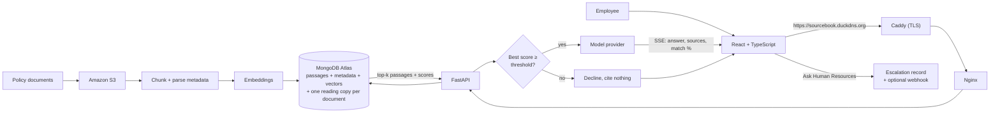

<p align="center">
  
</p>

<h1 align="center">Sourcebook</h1>

<p align="center">
  Answers employee questions about company policy and cites the document each answer came from.<br>
  When the documents do not cover a question, it says so and hands the question to a person.<br>
  A CMSC 495 capstone project, built for Meridian Systems, a fictional company.
</p>

<p align="center">
  <a href="https://github.com/CMSC495-GROUP3/Sourcebook/actions/workflows/ci.yml"></a>
  <a href="https://github.com/CMSC495-GROUP3/Sourcebook/actions/workflows/security.yml"></a>
  <a href="https://github.com/CMSC495-GROUP3/Sourcebook/releases"></a>
  <a href="https://sourcebook.duckdns.org"></a>
  <a href="https://github.com/astral-sh/ruff"></a>
  
  
  <a href="LICENSE"></a>
</p>

<p align="center">
  <a href="https://sourcebook.duckdns.org">Demo site</a> ·
  <a href="#start-here">Start here</a> ·
  <a href="#quick-start">Quick start</a> ·
  <a href="docs/architecture.md">How it works</a> ·
  <a href="docs/README.md">All docs</a> ·
  <a href="CONTRIBUTING.md">Contributing</a>
</p>

---

## Start here

| You are | Read first | Then |
| --- | --- | --- |
| Grading or evaluating the project | This page, from [The problem](#the-problem) through [Evidence](#evidence) | the [demo site](https://sourcebook.duckdns.org) with the [user guide](docs/user-guide.md), the `v1.0.0` [handoff](docs/releases/v1.0.0/handoff.md) and [portfolio](docs/releases/v1.0.0/portfolio.md), [quality.md](docs/quality.md), [evaluation.md](docs/evaluation.md) |
| Running or deploying it | [docs/install.md](docs/install.md) | [docs/ci-cd.md](docs/ci-cd.md) for the deploy pipeline, [docs/evaluation.md](docs/evaluation.md) to measure it |
| Changing the code | [Quick start](#quick-start), then [CONTRIBUTING.md](CONTRIBUTING.md) | [docs/architecture.md](docs/architecture.md), [docs/api.md](docs/api.md), [docs/design.md](docs/design.md) |

Every page under `docs/` is listed, grouped by task, in
[docs/README.md](docs/README.md).

## What it does

- **Cites every answer.** Each reply names the policy document it drew from and
  shows a retrieval-match score, so the reader can check it rather than trust it.
- **Refuses rather than guesses.** If the best retrieved passage scores below a
  threshold, no model call is made and the UI says the corpus does not cover
  the question.
- **Hands off to a person.** A refusal, or an answer that did not help, can be
  escalated to Human Resources from the same screen with the question and its
  sources attached.
- **Learns from its own log.** Every request records what was asked, what was
  retrieved, and whether it was refused. Refusals grouped by question are the
  list of documents to write next, and the most-asked questions show managers
  what to cover in training and orientation. [How that works](docs/architecture.md#learning-from-the-query-log).

## The problem

Employees lose hours hunting through scattered policy and onboarding documents,
and HR answers the same questions over and over. The documents usually do
contain the answer. Finding it is the expensive part. This system makes the
corpus searchable in plain language and returns an answer with its source, so
the reader can check it rather than trust it.

## Why retrieval-augmented generation

The system has to cite sources, and it has to pick up new documents without
retraining. Lewis et al. (2020) describe those two properties as what RAG
provides, which is why we chose it over fine-tuning a model on the handbook. A
fine-tuned model cannot point at the paragraph it drew from, and it goes stale
the day a policy changes.

Passages, metadata, and embeddings live in one MongoDB Atlas collection instead
of a vector store paired with a separate document store. Pan et al. (2024) name
hybrid queries, filtering on metadata and searching by vector in one operation,
as a central problem in the field, and count more than twenty commercial vector
databases appearing in five years. Keeping everything in one collection is the
consolidated approach that survey describes, not a shortcut. The one thing
stored beside it is a reading copy of each document, whole, for the Policy
Library to render; retrieval never queries it.

## Architecture



Docker Compose runs three services on one EC2 instance. OpenAI, MongoDB Atlas,
and Amazon S3 are managed services outside Compose.

| Service | Role                                                                                                                                                  |
| ------- | ----------------------------------------------------------------------------------------------------------------------------------------------------- |
| `caddy` | The only service that publishes ports. Terminates TLS with a Let's Encrypt certificate for `SITE_ADDRESS` and forwards to `web`.                      |
| `web`   | Builds the React app and serves it through Nginx. Proxies `/api/` to `api` with buffering off, so streamed tokens reach the browser as they are produced. |
| `api`   | FastAPI with the RAG pipeline. Not published; only Nginx can reach it.                                                                                |

Caddy, Nginx, and Uvicorn pass the client's address along an explicit trust
chain, so login rate limits count real clients and a forged
`X-Forwarded-For` is discarded. [docs/architecture.md](docs/architecture.md#client-identity-across-the-proxies)
has the chain and [install.md](docs/install.md#checking-a-deploy) the checks
that prove it on a running host.

## How a question is answered

1. On a follow-up, the utility model rewrites the question into a standalone
   one using the last three exchanges, since vector search has no memory.
2. The query is embedded with the same model used at ingestion.
3. Atlas Vector Search returns the 5 nearest passages out of 100 candidates,
   each with a similarity score.
4. The grounding gate. If the best passage scores below
   `SIMILARITY_THRESHOLD`, the system declines and makes no model call. If it
   clears, a coverage judge decides whether those excerpts actually answer the
   question.
5. Otherwise the passages, recent history, and previously cited documents go
   to the answer model with instructions to use only the supplied context.
6. Tokens stream to the browser over server-sent events, followed by the
   sources and the retrieval-match percentage, then three suggested follow-ups.
7. The exchange, its sources, and its score are saved. First-turn answers are
   cached for 24 hours under a key that changes whenever the corpus, a model,
   a prompt, or a retrieval setting does.
8. If the assistant refused, or the answer did not help, the employee can hand
   the question to a person from the same screen.

[docs/architecture.md](docs/architecture.md#how-a-question-is-answered) has
each step in full, including what the cache key holds.

## Keeping the model honest

Four risks the design had to answer, and where each answer lives in the code.
[docs/architecture.md](docs/architecture.md#keeping-the-model-honest) has each
one in full.

**Prompt injection: history stays on the server.** The server reads
conversation history from MongoDB by `session_id` and never accepts it from
the client, so a caller cannot post a forged `system` turn or forged sources.
`load_history()` in `sourcebook/api/routes/chat.py` replays only `user` and
`assistant` turns, so exactly one system message ever reaches the model.

**Hallucination: refuse rather than guess.** The gate is `is_grounded()` in
`sourcebook/rag/rag_chain.py`:

```python
return max(p.get("score", 0.0) for p in passages) >= threshold
```

It gates on the best passage, not the mean, so three weak neighbours cannot
veto one strong match, and it runs before generation, so a refusal costs no
generation tokens. A follow-up must clear the threshold both as rewritten and
as typed. Cosine alone could not separate covered from uncovered questions on
the sample corpus, so a coverage judge checks every turn that clears it; on
the smoke tier that moved unsupported-question and prompt-injection refusal
from 0% to 100% with recall, citation correctness, and grounded answers still
at 100% ([PR #253](https://github.com/CMSC495-GROUP3/Sourcebook/pull/253)).

**Refusals lead somewhere: escalation.** The refusal card has an Ask Human
Resources button, and every answer has a "not what you needed?" link. The
server copies the question and answer from its own record, never from the
client, and Human Resources works the queue on the HR Requests page, with an
optional webhook to Slack or Teams.

**Vendor lock-in: one interface, one env var.** Every model call goes through
`LLMProvider` in `sourcebook/rag/llm.py`, which exposes an `answer` role and a
cheaper `utility` role rather than model names. Swapping vendors is one
subclass and `LLM_PROVIDER`; only a new embedding model forces re-ingestion.

**Free-tier ceilings.** The 42-document sample corpus is 157 passages, about
1.7 MB of vectors, 0.33% of Atlas's free 512 MB. The binding costs are
per-query model calls, which is the other reason the gate runs before
generation.

## Evidence

The `v1.0.0` release was tagged on 2026-09-27. Its figures come from the
release candidate `7d3c779`. The later
[`v1.1.0`](docs/releases/v1.1.0/release-notes.md) changes only the What People
Ask report, so these figures apply to it too, except that the load run
predates the report's extra writes per ask. Each row links its source, and
all but the stubbed throughput figures are also in the
[shared evidence sheet](docs/releases/v1.0.0/evidence/numbers.md).

| What | Result | Where |
| --- | --- | --- |
| Answer quality, 20-case smoke tier | 100% recall@5, citation correctness, and grounded answers; 100% refusal of unsupported questions and prompt injection | [live evaluation](docs/releases/v1.0.0/live-evaluation.md) |
| Answer quality, 59-case full tier | 95.9% (47 of 49) recall@5, citation correctness, and grounded answers; 100% of 4 unsupported and 3 injection cases refused | [live evaluation](docs/releases/v1.0.0/live-evaluation.md) |
| Latency on the demo site | first token 1.18 s at p50; generated answers 3.3 s at most; refusals 0.05 s at most | [live benchmark](docs/releases/v1.0.0/live-benchmark.md) |
| Load on the demo site | 0 errors at 5, 10, and 20 concurrent users; at 40, 33 requests failed on the OpenAI rate limit and the app's own provider cap | [demo-site load run](docs/load-testing-demo.md) |
| Throughput, model stubbed | 14.9 req/s on the default thread pool, 98.7 req/s at 320 threads, against an 83 req/s target | [load-testing.md](docs/load-testing.md) |
| Test coverage | Python 93%; web 92% of statements in the files `web/vitest.config.ts` lists, not all of `web/src` | [coverage](docs/releases/v1.0.0/evidence/coverage.md) |
| Accessibility and performance | Lighthouse accessibility 100 in both themes | [Lighthouse](docs/releases/v1.0.0/evidence/lighthouse.md) |

The [handoff](docs/releases/v1.0.0/handoff.md) says what the release does and
does not establish, [quality.md](docs/quality.md) covers review and coverage,
and [team.md](docs/team.md) has each member's work. Earlier releases are
listed in [docs/README.md](docs/README.md#releases).

## Quick start

No cloud accounts, API keys, or `.env`. This runs the real application against
a fake model and an in-memory database. You need Python 3.11+, Node 22+, and
`make`.

```bash
make setup    # .venv, Python deps, npm install
make stub     # terminal 1: API on :8000, fake model, in-memory Mongo
make web      # terminal 2: React on :5173 with hot reload
```

Open <http://localhost:5173> and sign in with the password `dev`. Sign in with
`manager` to add the What People Ask page, or `hr` to add HR Requests as well. Every answer
is canned in this mode, so use it to see the UI and the refusal path
(`make stub REFUSE=1`), not to judge retrieval quality.

The demo site at <https://sourcebook.duckdns.org> runs against the real services.
Sign in with the shared password; ask the team for it. The instance is not
hosted around the clock, so a connection timeout means it is off, not broken.

Next: [docs/install.md](docs/install.md) for the real services and deployment.

## Known limitations

One line each; [docs/architecture.md](docs/architecture.md#limitations-in-detail)
has the full text.

- **Authentication is shared passwords** (the shared one, an optional second,
  and one each for Human Resources and managers), not per-employee accounts.
  It is the first thing to change before a real deployment.
- **The similarity threshold is untuned** against a real corpus, so the
  coverage judge does the separating, at the cost of one model call per
  grounded turn (#192).
- **Frontend unit coverage is focused** on the chat stream and the main
  pages; there is no visual regression or full browser suite.
- **Document search uses `$regex`**, which does not use an index. Fine at this
  corpus size.
- **JWTs live in browser local storage.** Acceptable for a class demo
  behind shared credentials.
- **Conversations belong to a browser, not a person**
  ([#290](https://github.com/CMSC495-GROUP3/Sourcebook/issues/290)). Clearing
  site data or switching devices loses the history.
- **Do not deploy under gunicorn `--preload`.** `MongoClient` is not
  fork-safe; `uvicorn --workers` is safe.
- **Re-ingestion is not atomic.** For a few seconds a moved chunk can be
  retrieved beside its replacement.
- **Hosting is one instance with no redundancy**, on a free DuckDNS
  subdomain.
- **The sample corpus is fictional.** "Meridian Systems" is invented.

## Team

CMSC 495 Group 3. The project pitch assigned the three Unit 5 roles.

| Role | Member | What the role owns here |
| --- | --- | --- |
| Lead Architect | Taylor Shahan ([@t-shahan](https://github.com/t-shahan)) | module boundaries in `sourcebook/`, the split between the API and `web/`, the deployment shape, and the architecture diagrams |
| Interface Designer | Daniel Tsang ([@DanielTsang26](https://github.com/DanielTsang26)) | the endpoint shapes, the streaming events, the `LLMProvider` interface, and the stored record shapes |
| Integration Lead | Chris ([@threshi-art](https://github.com/threshi-art)) | evaluation, verifying merged work as one system, and the evidence behind any release claim |

The pitch's words for Interface Designer are "API and interfaces", so that
role covers the contracts in section 2 of the design specification rather than
the visual design. Chris and Daniel divide integration work in practice, Chris
on day-to-day integration and evidence, Daniel on repository ownership and the
CODEOWNERS boundary.

The rest of the team: Gavin ([@gavinwathen](https://github.com/gavinwathen))
and Dominick ([@fudgepop01](https://github.com/fudgepop01)) build the React
components and own the design and styling; George Struder
([@Lazzy-dev](https://github.com/Lazzy-dev)) handles administration (the
EC2 instance, S3, and Atlas), dependency locks, and the MongoDB deployment; Rob
([@RoNUO](https://github.com/RoNUO)) works on corpus availability and the
passage index.

Per-person commits, reviews, and the issues that show the work are in
[docs/team.md](docs/team.md).

## References

Lewis, P., Perez, E., Piktus, A., Petroni, F., Karpukhin, V., Goyal, N., Küttler,
H., Lewis, M., Yih, W., Rocktäschel, T., Riedel, S., & Kiela, D. (2020).
Retrieval-augmented generation for knowledge-intensive NLP tasks. _Advances in
Neural Information Processing Systems, 33_, 9459-9474.

Pan, J. J., Wang, J., & Li, G. (2024). Survey of vector database management
systems. _The VLDB Journal, 33_(5), 1591-1615.

## License

[MIT](LICENSE)