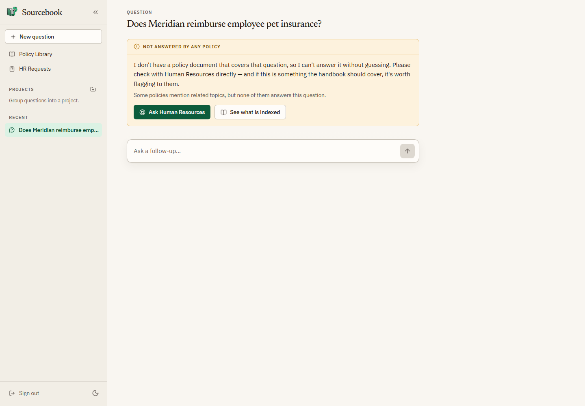
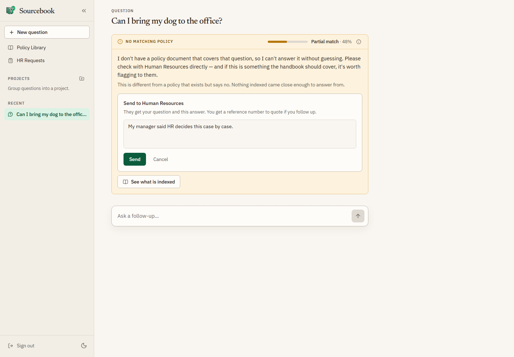

# User guide

How to use Sourcebook: asking a policy question, checking where the answer came
from, and handing a question to Human Resources when Sourcebook can't answer
it. The last two parts are for Human Resources and managers: working those
requests on the **HR Requests** page, and reading the **What People Ask**
report.

To run your own copy, see [install.md](install.md). Scripts and integrations
use the HTTP API in [api.md](api.md).

Most screenshots come from the recorded v0.2.0 beta pass on 2026-09-24, using
the fictional Meridian Systems sample policies. The untitled conversations in
their sidebar are leftover test sessions from that pass. The two refusal-card
screenshots were taken on 2026-09-26 on a local test copy with no real model
or policies (web app from `5b35d3c` on `main`), so they show the current
refusal wording. Provenance is in
[releases/v0.2.0/evidence/](releases/v0.2.0/evidence/README.md).

## Sign in

Open the pilot at <https://sourcebook.duckdns.org>. If you're running it
locally with the stub, the address is <http://localhost:5173> and the password
is `dev` (`manager` for a manager, `hr` for Human Resources).

Sourcebook uses a shared password, not personal accounts. Ask Human
Resources for it, type it in **Password**, and select **Sign in**.

Two other passwords open more. Each does everything the shared password does:

- **Managers and supervisors** sign in with the manager password. It also
  opens the **What People Ask** page.
- **Human Resources** staff sign in with the HR password. It also opens the
  **HR Requests** and **What People Ask** pages.

If sign-in fails, the message under the password box tells you why:

| Message | What to do |
| --- | --- |
| Incorrect password. | Check the password and try again. |
| Too many attempts. Wait a minute and try again. | Wait a minute. Repeated tries are limited. |
| Sign-in is unavailable right now. Try again in a moment. | The server isn't answering. Try again later, or tell whoever runs the site. |

## Ask a question

After you sign in you land on the question page, headed **What does the policy
say?** Type a question in plain words and press Enter, or pick one of the
examples under **Try one of these**. Shift+Enter starts a new line instead of
sending.

The answer appears as it's written. While it's being written, the box shows
**Answering…** and you can't send another question.

Under each answer you'll see:

- **A match meter**: **Strong match**, **Partial match**, or **Weak match**,
  with a percentage. It shows how closely the policy text Sourcebook found fits
  your question. It does *not* say whether the answer is correct. The info
  button beside it gives the same explanation. With a partial or weak match,
  read the source before relying on the answer.
- **Source buttons**: one for each policy document the answer drew from.
- **Follow up**: suggested next questions, under the latest answer only.
  Selecting one asks it right away. You can also type your own in **Ask a
  follow-up…**. Follow-ups use the earlier questions in the same conversation.

## Check a source

Select a source button under an answer. The **Source** pane opens beside the
answer on a wide screen, or over it on a narrow one, and shows the passages
Sourcebook used from that document. Select **Open in the Policy Library** to
read the whole document. Select the source button again, or the pane's
collapse or close button, to put it away.

If the pane says the document is no longer in the library index, it was
renamed or removed after the answer was written.

To browse every policy, select **Policy Library** in the sidebar. Search with
**Search by title…**, filter by category (select **All** to clear it), and
pick a policy to read it in full.

## When Sourcebook can't answer

Sourcebook won't guess. When the policies don't answer your question, you get
a card instead of an answer, with one of two headings:

- **No matching policy**: nothing indexed came close enough to answer from.
  The card still shows the match meter for the closest text it found. There's
  a picture of this card under [Ask Human Resources](#ask-human-resources).
- **Not answered by any policy**: some policies mention related topics, but
  none of them answers what you asked. This card has no match meter.

Neither one means the policy says no. It means the library doesn't cover the
question. The card offers **Ask Human Resources** and **See what is indexed**,
which opens the Policy Library.

*Not answered by any policy: the heading, the line saying related policies
don't answer the question, no match meter, and the two buttons.*

## Ask Human Resources

You can hand a question to Human Resources in two places:

- On a refusal card, select **Ask Human Resources**.
- Under an answer that didn't help, select **Not what you needed? Ask Human
  Resources**.

Then:

1. In the **Send to Human Resources** box, optionally add a note, such as what
   your manager told you or why the answer didn't fit.

   

   *No matching policy, with its match meter, after selecting **Ask Human
   Resources**. The box sits inside the card with a note typed, a **Send**
   button, and **Cancel**.*

2. Select **Send**. Human Resources gets your question and the answer you were
   shown. You don't need to retype them.
3. The box is replaced by **Sent to Human Resources · ref** followed by a short
   reference code. Keep it in case you follow up with Human Resources directly.

Each answer can be sent only once. After that it shows the same reference.
Sourcebook doesn't show you when Human Resources resolves your request, so
expect them to reach you directly.

If sending fails, the box explains why and the button becomes **Try again**.
If it says the conversation is out of sync, reload the page and send again.

## Your conversations

Every question you ask starts or continues a conversation. Conversations are
kept on the server and listed in the sidebar under **Recent**, so they're
still there after a reload or after you sign out and back in.

- **New question** starts a fresh conversation.
- Select a conversation to reopen it. Answers, sources, and follow-ups come
  back as they were.
- Hover over a conversation to rename or delete it. **Projects** in the
  sidebar group related conversations: create one with the **New project**
  button (the folder with a plus), then use a conversation's **Move to
  project** button to file it.

Your conversations and projects belong to the browser you asked them in, not
to the password you signed in with. Nobody signed in on another browser can
see them, and you can't see theirs. That also means:

- Signing out keeps them. Sign in again on the same browser and they're back.
- Clearing the browser's site data, or switching to another browser or
  device, starts with an empty list. The earlier conversations stay on the
  first browser.
- A link to a conversation opened on a different browser starts a new
  conversation and says "That conversation isn't available in this browser."

## Sign out and sessions

Select **Sign out** at the bottom of the sidebar. Sign-in lasts 24 hours on
that browser. After that, Sourcebook returns you to the sign-in page the next
time you open it or ask something. Your conversations stay with this browser.

The sidebar also has a light/dark theme switch. On a phone, open the sidebar
with the menu button at the top left. On a wide screen, you can collapse it to
a narrow strip of icons.

## If something goes wrong

| What you see | What it means |
| --- | --- |
| "The assistant is answering as many questions as it can right now…" with a **Retry in _N_s** button | Sourcebook is busy. When the countdown reaches zero, select **Retry** to ask again. If it's still busy after that, wait a moment and ask again. |
| "Sorry, something went wrong. Please try again." or "An error occurred while generating the response." | The answer didn't finish. Ask again, or start a **New question**. |
| "Could not load this source right now." in the Source pane | Close the pane and open the source again. |
| "Could not load the document library." | Reload the page. |
| You're suddenly back at the sign-in page | Your sign-in expired. Sign in again; your conversations are still there. |
| "That conversation isn't available in this browser." | The link points to a conversation started on another browser. You're in a new conversation instead; ask your question there. |

## For Human Resources: the HR Requests page

Select **HR Requests** in the sidebar. Every escalated question lands here.
Only someone signed in with the HR password can open this page. With the
shared or manager password, the sidebar doesn't show it, and opening a link to
it says "This page is for Human Resources. Sign out and sign in with the HR
password to see it."

On a wide screen the list sits on the left and the selected request on the
right. The newest request opens automatically. On a narrow screen you see the
list first; select a request to open it and **All requests** to go back.

- **Open** and **Resolved** switch between the two lists. The count beside
  **HR Requests** is the total for the list you're viewing.
- Each row shows the question, the start of the answer, whether it was
  **Refused** or marked **Unhelpful**, when it was sent, and its delivery
  status.
- The selected request shows the question, **Assistant response**,
  **Employee note**, **Reason**, **Confidence** (the match score for the policy
  text Sourcebook found; the employee doesn't see it on a **Not answered by
  any policy** card), **Sources**, and **Delivery**. A resolved request also
  shows its **Resolution**.

### Resolve or reopen a request

To resolve, type what you told the employee in **Resolution note** and select
**Resolve request**. The request moves to **Resolved** with your note.

To undo that, open the request under **Resolved** and select **Reopen
request**. It moves back to **Open**.

### Chat-channel delivery

Your team can also have new requests posted to a chat channel, such as Slack or
Teams. Whoever runs the site sets this up. **Delivery** on each request shows
where that stands:

| Delivery | Meaning |
| --- | --- |
| No webhook configured | No chat channel is set up. The request is only on this page. |
| Pending | Waiting to be posted, or being posted now. |
| Delivered | Posted to the chat channel. |
| Failed | Posting didn't work. |

When a post failed, or a request was never posted, a **Retry delivery** or
**Send to webhook** button appears. If the retry fails too, the page says
"Delivery was retried and failed again." After too many failed attempts the
button goes away and the page says delivery failed after the most attempts the
server allows.

### Empty lists and errors

- "No open requests…" means nothing is waiting for you.
- "Unable to load HR requests." Select **Try again**.
- "That request was not found." The link you followed points to a request that
  doesn't exist.

## For Human Resources and managers: What People Ask

Select **What People Ask** in the sidebar. It needs the manager or HR
password. It shows what employees asked Sourcebook, so Human Resources can see
which policies to write or make clearer, and managers can see what to cover in
training and orientation before new hires have to ask.

The page lists questions as employees typed them. It doesn't say who asked,
but a question can still identify someone, so keep what you read there inside
Human Resources.

Choose **7 days**, **30 days**, or **90 days** at the top. The first line
counts how many questions in that window had no policy to answer them, and
what share of all questions that was. The page updates every 5 minutes, so a
question asked in the last few minutes may not show yet. Below it are two lists:

- **Not answered yet**: questions no policy answered, most asked first. Each
  one points to a policy to write or make clearer.
- **Asked most**: questions asked in at least two conversations, ranked by how
  many. Each bar is green for the times a policy answered and orange for the
  times none did.

Rewordings of one question share a row: nearly identical wordings merge on
their own, and Sourcebook checks closer calls with its language model. **Also
asked as _N_ other wordings** opens the other ways people put it. A question
asked in quite different words can still appear as two rows, so the counts are
a floor. Two notes under the headline can appear:

- "Rewordings are not being checked right now, so only near-identical
  wordings share a row." The check is unavailable; more rewordings get their
  own row until it's back.
- "_N_ pairs of close wordings are still waiting to be checked, so some
  rewordings may have their own row. Reload to check the next batch." Each
  load checks a limited number of pairs. Reload the page to check more.

**What a manager sees.** A question typed once can point to the person who
typed it, and a manager isn't a confidential channel the way Human Resources
is. So when you sign in with the manager password, both lists leave out any
question asked in fewer than 3 separate conversations. The headline counts
still include every question. The page says this at the top.

| What you see | What to do |
| --- | --- |
| "This page is for managers and Human Resources. Sign out and sign in with the manager or HR password to see it." | You signed in with the shared password. Sign out and sign in with the manager or HR password. |
| "Unable to load this report." | Select **Try again**. If it keeps failing on 90 days, choose a shorter window. |
